# Implemented URL-to-demo flow

This supplements the preserved research and simplified plan. The app is being verified in the isolated `Website-cloning-build` checkout; final review status is recorded separately.

```mermaid
flowchart LR
 A[Operator opens preview workshop] --> B[Sign in]
 B --> C[Paste public store or B2B URL]
 C --> D[Bounded static fetch and extraction]
 D --> E[Save sample catalog and local images]
 E --> F[Render Demo - Store Name]
 F --> G[Home / collection / item views]
 G --> H[Operator enables private share link]
 H --> I[Prospect explores demo]
 I --> J[Local cart and quote only]
```

## Where the URL is entered

The internal operator signs in at `http://127.0.0.1:4320` and pastes a URL into the workshop dashboard. The first milestone is operator-led; a public self-service generation form is not enabled. The dashboard shows building, ready, or failed status and offers preview, retry, delete, and explicit sharing controls.

## What comes out

A small reconstructed site named **Demo - Store Name**, with home, collection/solutions, and reusable item views. The default limit is six retail products or three B2B offerings, sampled from at most four same-origin pages. Images are saved locally. Source name, imagery, typography family, colors, and supported layout evidence inform trusted templates. This is a bounded approximation, not a universal pixel-perfect clone.

Private sharing uses a random token that establishes a separate visitor session. Rotation or stopping sharing revokes access. Local quantities and quote drafts demonstrate interaction without placing orders or contacting a merchant system.

## Hosting

Currently this is a local Node app on port 4320. No remote service has been deployed. A single maintained Node LTS server behind an HTTPS reverse proxy can host both the dashboard and all generated previews. The app directory contains the deployment recipe; a persistent DATA_DIR holds records and captured assets. Each prospect gets an isolated path/session, not a new deployment or custom domain. This keeps hosting and operations simple.

## Integration later

The website builder runs independently of the commerce initiative on port 4310. The existing sales widget needs an adapter to the demo catalog/session API before embedding: its current cart callback occurs after a backend write, so it cannot safely be assumed to target demo-only state. This milestone documents the interface but does not claim a working embedded agent.

## Boundaries

Public server-rendered pages are supported. JavaScript-only, login-protected, bot-protected, or unrecognizable catalogs can fail with a useful message. Browser-driven source capture, universal layout reconstruction, automatic cloud deployment, automatic expiration, and public self-service intake remain later extensions. Browser testing of the generated output is implemented independently of source capture.
